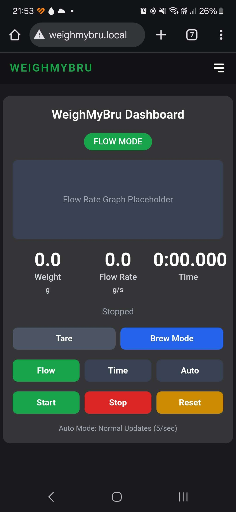
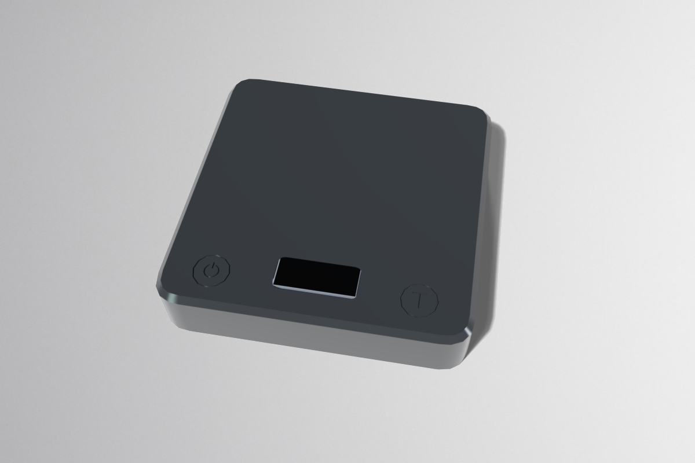

<p align="center">

</p>

<p align="center">  <b>The smart coffee scale that doesn't break the bank!<br>https://weighmybru.com</p>
<br>


[](https://discord.gg/HYp4TSEjSf)
[](LICENSE)

This project is a smart coffee scale with a webserver hosted on the ESP32-S3.
This scale was designed to be used in conjunction with GaggiMate, but can also be used as a standalone scale. The project is still in a beta phase and is actively being worked on. Please head over to the [Discord](https://discord.gg/HYp4TSEjSf) server for more info. This scale was inspired by [EspressiScale](https://www.espressiscale.com) but with a non-custom PCB approach. The idea is to be low-cost, easily sourcable scale.

<br>
<br>
<p>


</p>

## Documentation

The documentation, build video guide, flashing software etc. can be found on the website. 

[WeighMyBru Guides](https://weighmybru.com/guides/)

## Features

- Webserver via WiFi
- Bluetooth connectivity to GaggiMate
- Calibration via webserver
- Real-time flowrate display
- Adjustable decimal point readings
- Different modes for to cater for espresso and pour-overs


## GaggiMate

GaggiMate now fully supports WeighMyBru scale.

[GaggiMate](https://github.com/jniebuhr/gaggimate)

## Installation

Installation instructions are currently under development, for now follow the [link](https://031devstudios.github.io/weighmybru-docs/#/installation/flashing) for step-by-step installation instructions. Additionally, a video is available on [YouTube](https://www.youtube.com/watch?v=O5SP40Liuq0)

```
  this project requires VSCode with PlatformIO extension installed
```

### Important: Filesystem Upload Required

After uploading the firmware, you **must also upload the filesystem** for the web interface to work:

```bash
# Upload filesystem (required for web interface)
pio run -t uploadfs

# Or use the specific environment for your board
pio run -e esp32s3-supermini -t uploadfs  # For ESP32-S3 Supermini
pio run -e esp32s3-xiao -t uploadfs       # For XIAO ESP32S3
```

**Without the filesystem upload:**
- The device will function normally for scale operations
- The web interface will be unavailable
- You'll see a clear message explaining how to fix this issue

### 🌐 Web-Based Installation (Recommended)

For beginners, we now support **ESP32 Web Tools** for easy browser-based installation:

1. **Visit [weighmybru.com](https://weighmybru.com)** 
2. **Connect your ESP32 board** via USB
3. **Click "Install Firmware"** and select your board:
   - ESP32-S3 Supermini
   - XIAO ESP32S3
4. **Follow the prompts** - no software installation required!

**Benefits:**
- ✅ No need to install VS Code or PlatformIO
- ✅ Automatic latest firmware version
- ✅ Complete installation (firmware + filesystem)
- ✅ Works on any modern browser (Chrome, Edge, Opera)
- ✅ Version checking and device information

For advanced users or development, continue with the PlatformIO instructions below.

## Bill Of Materials (BOM)

| Qty |           Item                      | Amazon Link | Aliexpress Link |
| --- | ----------------------------------- | -----------------------| --------------- |
|  1  | 500g Mini Loadcell (I-shaped)       | https://a.co/d/6kvxZ0H | https://www.aliexpress.us/item/3256810229632696.html |
|  1  | HX711                               | https://a.co/d/3KiYRkA | https://www.aliexpress.us/item/3256806665065792.html |
|  1  | ESP32-S3-Supermini Board            | https://a.co/d/6289vbS | https://www.aliexpress.us/item/3256806649605779.html |
|  2  | Capacitive Touch Pads               | https://a.co/d/014di6l | https://www.aliexpress.us/item/3256806118244119.html |
|  1  | 0.91" SSD1306 OLED Display          | https://a.co/d/9UClWku | https://www.aliexpress.us/item/3256807486098308.html |
|  1  | 800mAh Li-ion Battery               | https://a.co/d/gbr1Yft | https://www.aliexpress.us/item/3256809665395688.html |
|  1  | JST-PH 2.0 Male Connector           | https://a.co/d/3BZGuHW | https://www.aliexpress.us/item/3256808498055527.html |
|  1  | 5mm Slide Switch                    | https://a.co/d/9KRqMyF | https://www.aliexpress.us/item/3256808144255016.html |
|  1  | Hookup Wire (Various Colors)        | https://a.co/d/1Fs8os9 |  |
|  2  | M3x5x4 Heat Set Inserts             | https://a.co/d/bnQD7Iu |  |
|  16 | M1.7x4 Self Tapping Screws          | https://a.co/d/1np5Nes | https://www.aliexpress.us/item/2255800110173778.html |
|  4  | M3x12 Button Head Screws            | https://a.co/d/iqM3d6E | https://www.aliexpress.us/item/3256807424674896.html |
|  2  | 100K ohm 1% 1/4w resistors          | https://a.co/d/3R0YmGM |  |
|  4  | Self-Adhesive Rubber Feet           | https://a.co/d/0q9TRmR |  |
|  1  | Double Sided Tape (To hold Battery) | https://a.co/d/gM5SWwH |  |


## Printed Parts (Found in CAD Folder)

| Qty |           Item                    | 
| --- | ----------------------------------|  
|  1  | Bottom*                           |  
|  1  | Top                               |
|  1  | ESP32 Clamp                       |
|  1  | Screen Clamp                      |
|  4  | M2 Washers (Used for HX711)       |

\* Bottom has 2 options - The supported option has engineered supports, while the standard option requires you to slice with your own supports.
